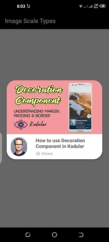
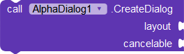
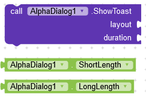
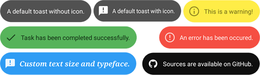

# Alpha Dialog
 Alpha Dialog is a simple yet powerful and easy to use extension that you can use freely in your projects to create awesome and unique dialogs. The extension allows you create transparent dialogs, full screen dialogs and by using a very simple technique you can use custom color for dim.

---

## Screenshots

---

## Download
**AIX :** [Kodular Community](https://community.kodular.io/t/update-free-alpha-dialog-transparent-dialogs-custom-toasts-and-much-more/98530)

**AIA :** [Kodular Community](https://community.kodular.io/t/update-free-alpha-dialog-transparent-dialogs-custom-toasts-and-much-more/98530)

---

 ## Functions
---

> 

### Create Dialog
Create Dialog using any visible component.

***layout*** : any visible component

***cancelable :*** whether to dismiss dialog when user clicks outside the dialog

---

> 

### Show Dialog

---

> 

### Dismiss Dialog

---

> 

### Show Toast
Show any visible layout or component as a toast. If you are bored using the same text toast again and again and want to make your app look even more better then you can use this block and show custom layouts as toasts. 

***layout*** : any visible component

#### Samples

> 

---

## Events
---

> 

### On Show
Event raised when dialog is shown.

---

> 

### On Dismiss
Event raised when dialog is dismissed.

---

## Properties
---

> 

### Wrap Content
If Wrap Content is enabled then dialog will force its content to shrink. If false it will cover whole screen. Set this to false to show a full screen dialog.