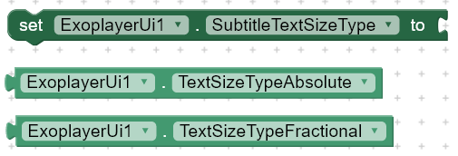
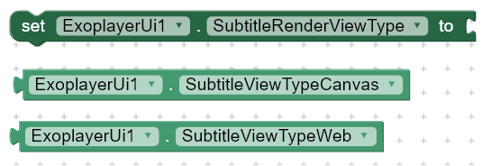

# Exoplayer UI - Open Source
This extension provides prebuilt ui that you can use in your apps without having to create from scratch.

[View On Github](https://github.com/zainulhassan815/exoplayer-appinventor)

---

## Screenshots

---

## Download

**AIX :** [Github](https://github.com/zainulhassan815/exoplayer-appinventor/tree/v1.0.4/exoplayer-ui/out)

**AIA :** [Github](https://github.com/zainulhassan815/exoplayer-appinventor/blob/v1.0.4/aia/exoplayer_with_title.aia)

**Upload Icons :** [Icons.zip](https://downgit.github.io/#/home?url=https://github.com/zainulhassan815/exoplayer-appinventor/tree/main/images/upload-icons)

---

## Functions
---

> 

### Create Simple Player
Create player view in a layout with basic controls.

***layout :*** horizontal or vertical arrangement

***exoplayer :*** exoplayer instance from Core Library

---

> 

### Create Styled Player
Create player view in a layout with extra controls like toggle captions, track selection etc.

***layout :*** horizontal or vertical arrangement

***exoplayer :*** exoplayer instance from Core Library

---

> 

### Show Controls
Show player controls.

---

> 

### Hide Controls
Hide player controls.

---

> 

### Show System UI
Can be used to exit fullscreen. The function is in experimental phase and may not work properly.

---

> 

### Hide System UI
Can be used to enter fullscreen. The function is in experimental phase and may not work properly.

---

## Events
---

> 

### On Fullscreen Changed
Event raised when fullscreen button is clicked and its status changes. Here you can perform different functions to enter or exit fullscreen.

***isFullscreen :*** boolean

#### Sample Usage
> 

---

> 

### On Visibility Changed
Event raised when controls visibility changes. Here you can update your UI. For example : You can show/hide a title label etc.

***visible :*** boolean

---

## Properties
---

> 

### Use Artwork
Set whether to show an image when playing an audio file.

---

> 

### Default Thumbnail
Set default thumbnail in case if there is no thumbnail in media metadata, the player will show this thumbnail. It works only for audio files.

---

> 

### Set Repeat Modes
Set repeat toggle modes. This will show/hide repeat toggle button.

---

> 

### Show Loading
Set when to show loading progress indicator.

---

> 

### Resize Mode
Set video resize mode.

---

> 

### Auto Show Controller
Automatically show controller when media is interupted during playback.

---

> 

### Controller Timeout
Milliseconds after which the controller should hide automatically.

---

> 

### Hide On Touch
Automatically hide controller on touch

---

> 

### Use Controller
Whether to use default controller or not.

---

> 

### Animation Enabled
Enable/Disable controls animation.

---

## Track Properties
---

> 

### Thumb Size
Thumb size when slider is visible but is not being dragged.

---

> 

### Active Thumb Size
Thumb size when slider is being dragged by the user.

---

> 

### Disabled Thumb Size
Thumb size when slider is disabled.

---

> 

### Track Color

---

> 

### Buffered Track Color

---

> 

### Track Progress Color

---

## Subtitle Properties
---

> 

### Subtitles Background Color
Set background color for subtitles.

---

> 

### Subtitles Foreground Color
Set text or foreground color for subtitles.

---

> 

### Subtitles Edge Color
Set edge color for subtitles. I am not quite sure what it does, so you can experiment with this to find out more about it.

---

> 

### Subtitles Window Color
Set color for whole subtitle layout.

---

> 
>
> 
>
> 

### Text Size Type
Specify how you want to scale subtitles font size.

---

> 

### Subtitle Render View Type
Specify what type of view to use for rendering subtitles.

---

> 

### Subtitle Edge Type

---

> 

### Subtitle Bottom Padding
Set bottom padding for subtitles.

---

> 

### Ignore Bottom Padding

---

> 

### Subtitles Typeface
Specify a custom font for subtitles.

---

## Fix Common Issues
---

### 1- Player won't work after screen off or app is minimized
You can easily fix this issue by using the blocks given below :

> 