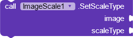

# Image Scale
It is a simple and but useful extension you can use to change scale type of image. Changing scale type of image specifies how the image should expand or shrink in order to fit into the defined width and height. It may seem simple but it can help to achieve complex designs that depend on images easily.

---

## Screenshots

---

## Download

AIX : [Kodular Community](https://community.kodular.io/t/image-scale-type-make-images-look-the-way-you-want/98426)

---

## Functions

---

> 

### Set Scale Type
Set scale type of image. Provide the image view component that you want to set scale type for and the scale type from properties section.

***image :*** image component

***scaleType :*** integer that specifies scale type

---

## Properties

---

> 

### Scale Types