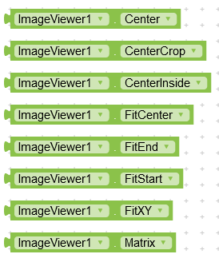

# Image Viewer

You can use this extension to view images like Facebook and Instagram etc. The user can double tap or pinch to zoom. It supports all images : URL, assets, local.

---

## Download

**AIX :** [Kodular Community](https://community.kodular.io/t/image-viewer-pinch-to-zoom-double-tap-to-zoom-animated-zoom/126671)

**AIA :** [Kodular Community](https://community.kodular.io/t/image-viewer-pinch-to-zoom-double-tap-to-zoom-animated-zoom/126671)

---

## Functions

---

> 

### Create
Create Image Viewer in a layout.

***layout :*** any visible component

***path :*** path to image file

---

## Events

---

> 

### On Scale Changed
Event triggered when scale changes. You can find current scale, x and y positions.

---

## Properties

---

> 

### Path
Change image path. It supports all images : URL, assets, local.

---

> 

### Transition Duration
Set animation duration in milli seconds.

---

> 

### Zoomable
Enable or disable zoom.

---

> 
>
> 

### Scale Type
Set initial scale type of image.