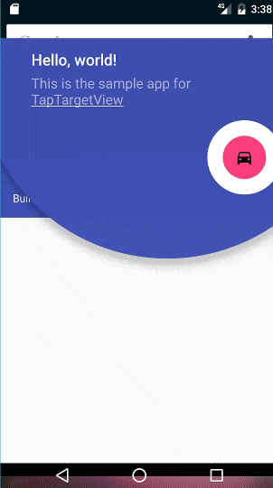
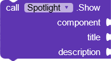
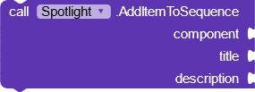
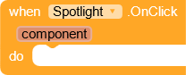
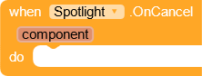
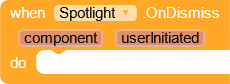
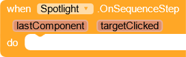
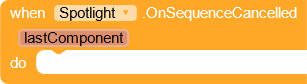

# Material Spotlight
An extension to show a material spotlight for your components.

---

## Screenshots

---

## Download

AIX : [Kodular Community](https://community.kodular.io/t/material-spotlight-show-case-extension-based-on-google-material-guidelines/132249)

---

## Functions

---

> 

### Show
Show spotlight for a single component.

---

> 

### Dismiss
Dismiss spotlight.

---

> 

### Add Item To Sequence
Create a sequence of spotlight components. In order to show a sequence of spotlights, use this block to add all the components

---

> 

### Start Sequence
Start spotlight sequence.

---

> 

### Cancel Sequence
Cancel spotlight sequence.

---

> 

### Clear Sequence
Clear sequence. Use this block to clear out previous components that were added using AddItemToSequence block. Use this block when you want to create a new sequence.

---

## Events

---

> 

### On Click
Event raised when a component is clicked.

---

> 

### On Cancel
Event raised when spotlight is cancelled.

---

> 

### On Dismiss
Event raised when spotlight is dismissed.

---

> 

### On Sequence Step
Event raised when sequence proceeds.

---

> 

### On Sequence Cancelled
Event raised when sequence is cancelled.

---

> 

### On Sequence Finished
Event raised when sequence is finished.

---

## Properties

---

> 

### Outer Circle Color

---

> 

### Outer Circle Opacity
Opacity of outer circle. Use a value between 0 and 1.

---

> 

### Target Circle Color

---

> 

### Title Color

---

> 

### Description Color

---

> 

### Title Font

---

> 

### Description Font

---

> 

### Title Size

---

> 

### Description Size

---

> 

### Transparent Target

---

> 

### Tint Target

---

> 

### Dim Color

---

> 

### Draw Shadow

---

> 

### Target Radius

---

> 

### Description Opacity

---

> 

### Cancelable