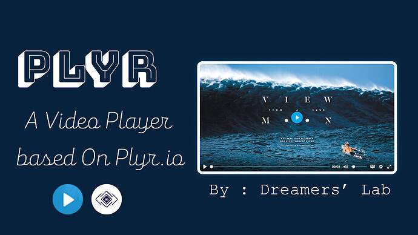

# Plyr Video Player - Open Source
Plyr is a simple and straightforward way to implement an awesome video player in your apps without worrying about state management. It has tone of features that make it stand out against other players in the market. You can freely use it in your personal & commercial projects. It is based on [Plyr.io](https://plyr.io/)

[View On Github](https://github.com/zainulhassan815/plyrio)

---

## Screenshots

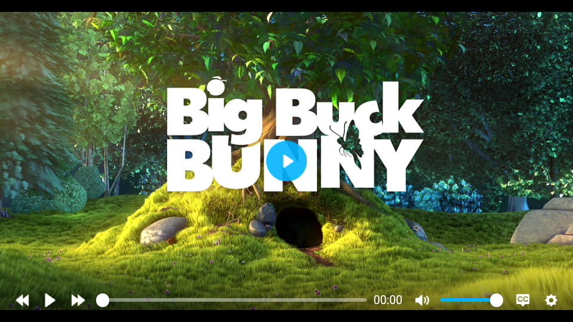
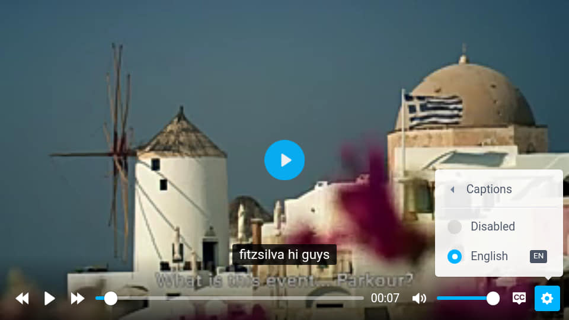
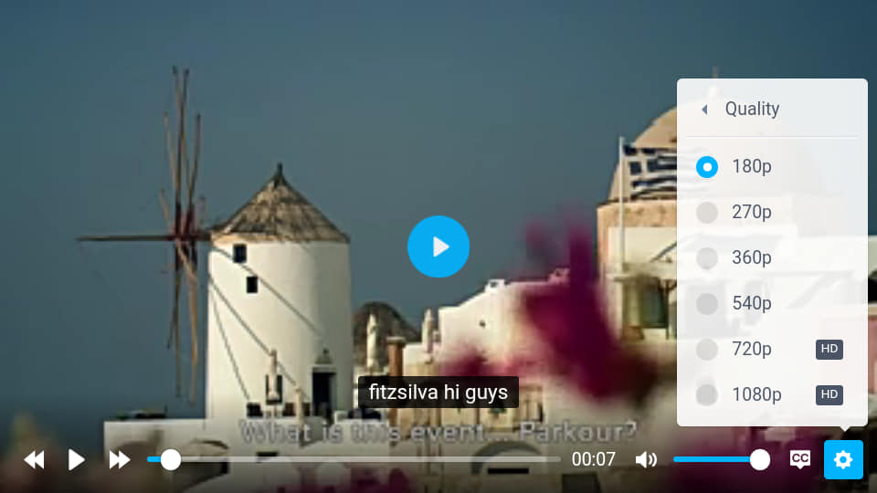

---

## Download

**AIX :** [Kodular Community](https://community.kodular.io/t/v-2-0-6-plyr-video-player-fullscreen-qualities-captions-thumbnail-attaractive-ui/112735)

**AIA :** [Kodular Community](https://community.kodular.io/t/v-2-0-6-plyr-video-player-fullscreen-qualities-captions-thumbnail-attaractive-ui/112735)

---

## Functions
---

> 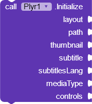

### Initialize
Use this block to setup player inside an arrangement.

***layout :*** arrangement

***path :*** path to media file

***thumbnail :*** image that you want to show as a thumbnail. Either offline or online

***subtitle :*** subtitle path. File format should be SRT

***subtitle language :*** language of subtitle file

***media type :*** specify the type of media that you are using. Media Type blocks are given in the extension

***controls :*** provide a list of controls that you want to show

---

> 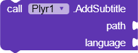

### Add Subtitle
Add a new subtitle file. Multiple subtitle files are supported.

***path :*** path to media file

***language :*** language of subtitle file

---

> 

### Play Media

---

> 

### Pause Media

---

> 

### Stop Media
Reset video to initial position.

---

> 

### Remove Subtitles
Remove all subtitles

---

> 

### Forward
Seek forward.

---

> 

### Rewind
Seek Backward or rewind.

---

> 

Get information about the current video. It returns a dictionary object that can easily be used with dictionary blocks to find specific information. It returns following info :

- Path
- Media Type
- Thumbnail
- Duration
- List Of Qualities
- Title of video

---

## Events
---

> 

### On Ready
Event Raised when video player is ready.

---

> 

### On Play
Event Raised when video is played.

---

> 

### On Pause
Event Raised when video is paused.

---

> 

### On Complete
Event Raised when video is completed.

---

> 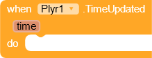

### Time Updated
Event Raised when current position of video is changed.

---

> 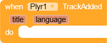

### Track Added
Event Raised when a new subtitle track is added to the player.

---

> 

### Got Metadata
Event Raised when player returns an object of Metadata that you can use to find information about current video.

---

> 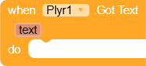

### Got Text
This block returns the current caption text that you can use to show captions in custom view.

---

> 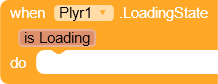

### Loading State
Event Raised when loading state of the player changes. You can use this to show some loading animation in custom design

---

> 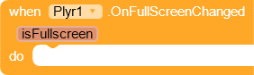

### On Fullscreen Changed
Event Raised when full screen state changes. You can use this to change orientation of screen.

---

> 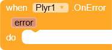

### On Error
Event Raised when there is an error.

---

## Properties
---

> 

### Loop
Enable or disable loop.

---

> 

### Source
Change video source.

***Remember*** : It only works if you have not initially used a m3u8 link.

---

> 

### Current Quality
Change the quality of the video. It works only when you are using a HLS file that has multiple qualities. It takes index of the quality.

---

> 

### Captions Visible
Set the captions visible to true or false.

---

> 

### Current Text Track
Change current subtitles track. It accepts index of the track.

---

> 

### Speed
Change the speed of the player.

---

> 

### Thumbnail
Change the thumbnail of the video.

---

> 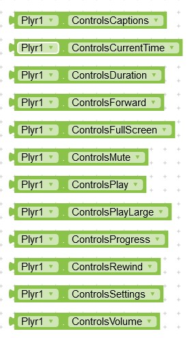

### Available Controls
These are the controls that you can provide to player in initialize block.