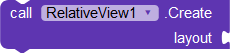
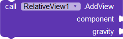
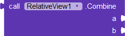
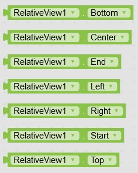

# Relative View

Relative is a simple and easy to use overlapping extension based on [Relative Layout](https://developer.android.com/reference/android/widget/RelativeLayout) which enables you to create complex overlapped UIs easily. The UI is persistent across devices. It doesn’t matter if the device is wide or long. It keeps the UI as it is in all devices.

---

## Screenshots

---

## Download

**AIX :** [Kodular Community](https://community.kodular.io/t/relative-view-extension-overlap-like-a-pro-complex-uis-made-simple-in-kodular/108707)

---

## Tutorials

- [How to Overlap Components Like a pro](https://www.youtube.com/watch?v=C42NAQJG6Eg)

---

## Functions

---

> 

### Create
Use this block to create a Main Layout that will hold all others views. You can use horizontal or vertical arrangement for this purpose.

***layout :*** arrangement

---

> 

### Add View
Add views to you the main layout created using the about block. Use [gravity blocks](#available-gravities) from extension to place component at different locations.

***component :*** any visible component

***gravity :*** an integer that specifies the location where view should be placed

---

> 

### Combine
Use this block to combine different gravity like Top and Left, Top and Right etc.

---

## Properties

---

> 

### Available Gravities
Available Gravity blocks in the extension.