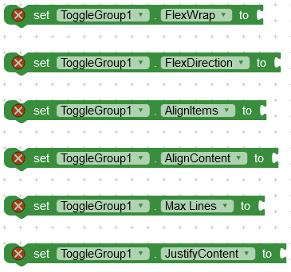

# Toggle Button Group

Lets you create simple and elegant button group. It can be configured for single selection or multi selection. For multi selection the minimum/maximum amount of buttons that are required/enabled can be specified. Icon’s can be added. Selection includes a fun press and circular reveal animation.

---

## Download

**AIX :** [Kodular Community](https://community.kodular.io/t/toggle-button-tags-group-create-simple-and-elegant-button-tag-group/134049/1)

**AIA :** [Kodular Community](https://community.kodular.io/t/toggle-button-tags-group-create-simple-and-elegant-button-tag-group/134049/1)

---

## Functions

---

> 

### Create
Create button container in a layout.

***layout :*** arrangement

---

> 

### Add

Add a new button to the group. If no selected text is provided then default text is used. If no selected icon is provided then default icon is used.

***text :*** title

***selectedText :*** selected title

***icon :*** asset image

***selectedIcon :*** selected asset icon

***tag :*** unique id or tag

---

> 

### Remove Button
Remove button from group.

***tag :*** unique id or tag

---

## Events

---

> 

### On Selected
Event raised when item is selected.

***tag :*** unique id or tag of selected button

---

## Properties

---

> 

### Select Animation
You can use any of these animations :

CircularReveal| Fade | HorizontalSlide
--- | --- | --
 |  | 

VerticalSlide| HorizontalWindow| VerticalWindow
--- | --- | ---
 |  | 

---

> 

### Selectable Amount
Maximum number of items that can be selected. Default value is 1.

---

> 

### Required Amount

Required selection amount. Default value is 1.

---

> 

### Spacing
Item spacing. Default is 8.

---

> 

### Flex Properties
Read detailed guide here : [CSS Flex Box](https://community.kodular.io/t/flexbox-css-flexible-box-layout-module-for-kodular/132608)

---

> 

### Font
Custom font for text. Upload font as asset.

---

> 

### Font Size

---

> 

### Text Color

---

> 

### Selected Text Color

---

> 

### Horizontal Text Padding

---

> 

### Vertical Text Padding

---

> 

### Background Color

---

> 

### Selected Background Color

---

> 

### Icon Size

---

> 

### Icon Spacing

---

> 

### Border Radius

---

> 

### Border Width

---

> 

### Selected Border Width

---

> 

### Border Color

---

> 

### Selected Border Color