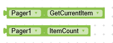
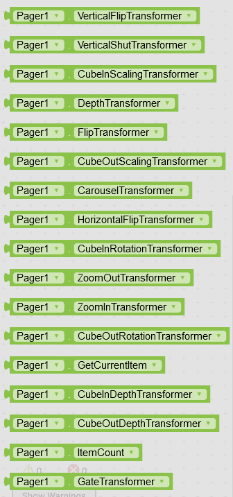

# View Pager
View Pager is a simple extension and is based on ViewPager library provided by android. It works the same as builtin viewpager component but has custom animations to help you make your app look even better with awesome animations. You can easily make Image carousels , Card carousels etc.

---

## Download

**AIX :** [Kodular Community](https://community.kodular.io/t/androidx-view-pager-extension-view-pager-with-custom-animations-and-much-more/98749)

---

## Functions

---

> 

### Create
Initialize view pager inside a layout.

***layout*** : arrangement

---

> 

### Add View
 Add a view to pager. You can pass arrangements, card views or you can say all visible components.

***view :*** any visible component

---

> 

### Remove View
Pass the view that you want to remove.

***view :*** visible component that you want to remove

---

> 

### Remove View At index
Remove view at specific index.

***index :*** the index of component that you want to remove

---

> 

### Remove All Views
Remove all views.

---

> 

### Set Current Item With View
Set a view as current visible item.

***view :*** visible component that you want to set as current item

---

> 

### Set Current Item With Index
Set item at specific index to be the current visible item.

***index :*** the index of component that you want to set as current item

---

## Events

---

> 

### On Page Changed
Event raised when current page changes.

***index :*** index of current visible page

---

## Properties

---

> 

### Current Item & Item Count
Get current item’s index and total items respectively.

---

> 
>
> 

### Page Transformer
Choose a transformation animation for viewpager. You need to set animation before creating viewpager.